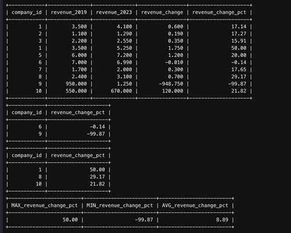

# Sustainability & Revenue – SQL Case Study

This project analyzes the potential impact of sustainable business practices on company revenue using SQL. The goal was to simulate a realistic scenario where 10 companies from different sectors and countries implement eco-friendly techniques and observe how their revenue changes over time.

---

### Project Goal

To explore whether companies that introduce sustainability initiatives (e.g., eco packaging, electric vans, local partnerships) experience growth or decline in their revenues from 2019 to 2023.

The project was created entirely in MySQL from scratch – starting with data modeling and ending with KPI-style queries.

---

### Technologies Used

- MySQL (written in OneCompiler)
- SQL joins, subqueries, aggregates
- Manual data design & entry
- GitHub (documentation and versioning)

---

### Database Structure

The project includes 3 main tables:

- `companies` – company name, industry, and country
- `sustainability_techniques` – which techniques were implemented, in what year, and their effectiveness level (High, Medium, Low)
- `financial_data` – yearly revenue data from 2019 to 2023

---

### Key Analyses

- Revenue comparison between 2019 and 2023 (absolute and % change)
- Companies with revenue decline
- Top 3 companies with highest revenue growth
- KPI summary (MAX, MIN, AVG of revenue change in %)

---

### Project Preview

#### 1. SQL Code Sample

This screenshot shows the core logic used to compare company revenues between 2019 and 2023, including percentage change calculations and KPI metrics.

[queries (5).sql](queries%20(5).sql)

#### 2. Query Result – Revenue Change Output

These images shows the output table with calculated revenue change for each company. It includes company IDs, revenue in 2019 and 2023, and the computed percentage difference.

---

### Author

Created by Kinga Jutrzenka Tzrebiatowska  
GitHub: kingajutrzenka
